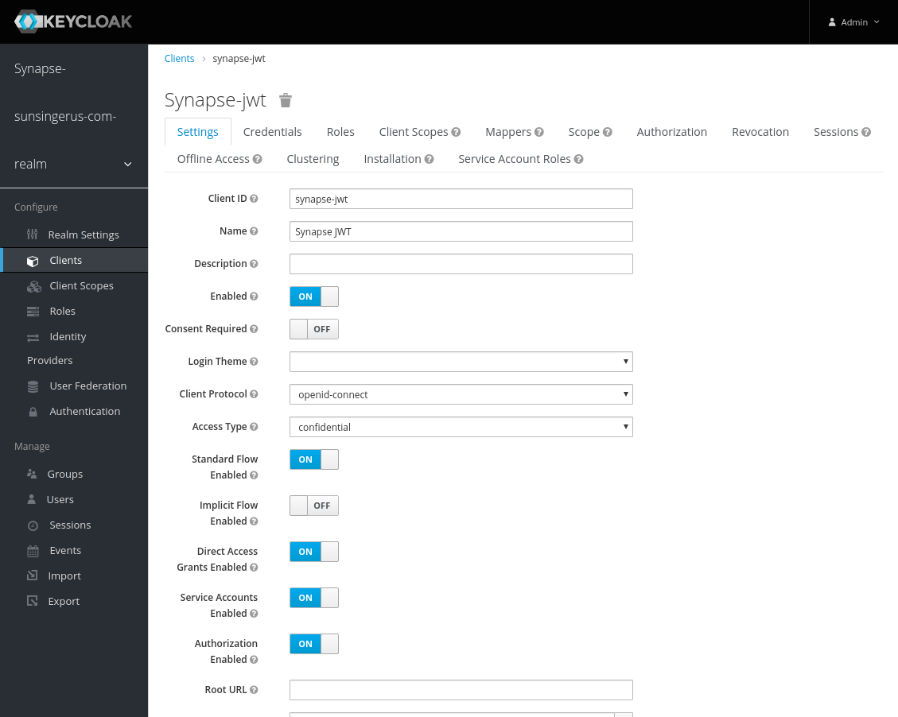
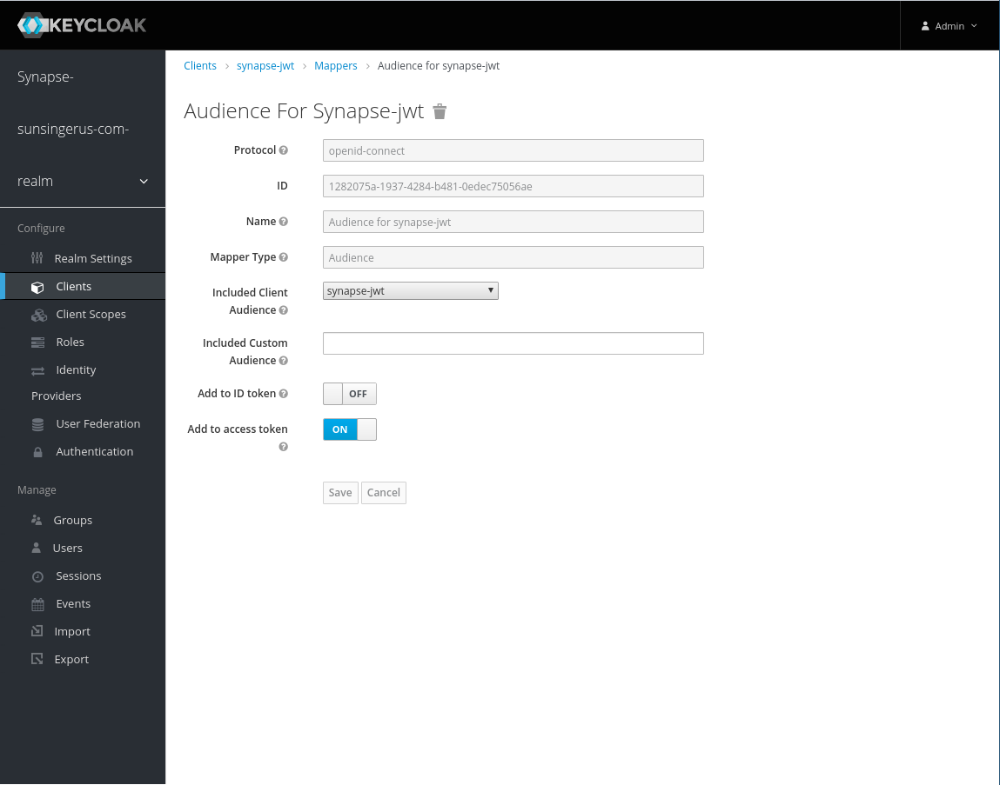
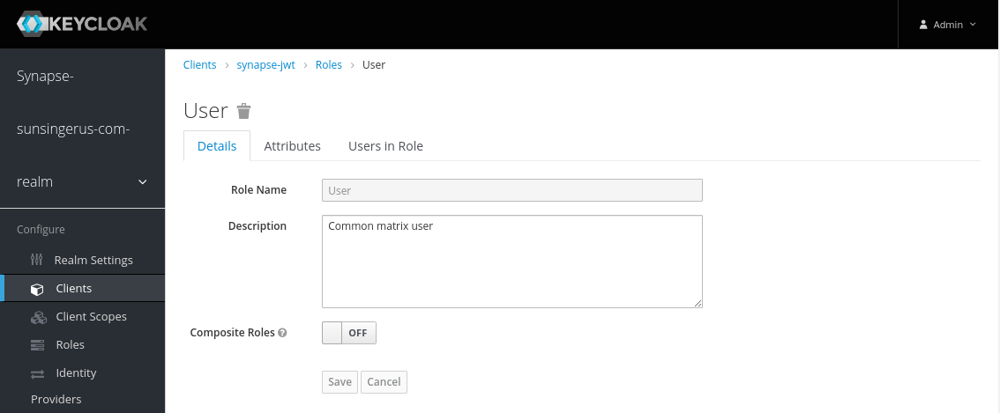
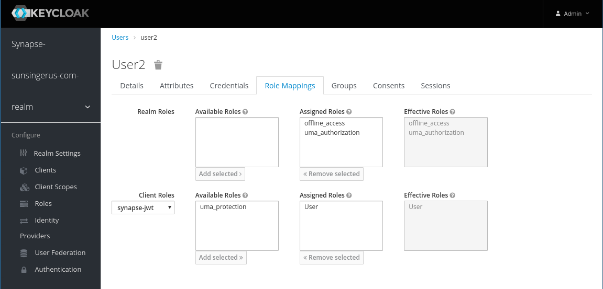

# How to setup JWT with Keycloak

Login into Keycloak

### Create realm
```
synapse-sunsingerus-com-realm
```


### Create client
```
synapse-jwt
```

Set Access Type to confidential

Enable "Service Accounts" and "Authorization" flags

At the end of the day client should looks like:



### Create mappers

Audience mapper(fix [keycloak](https://issues.jboss.org/browse/KEYCLOAK-6638) ):



### Create roles

User


### Assign roles



