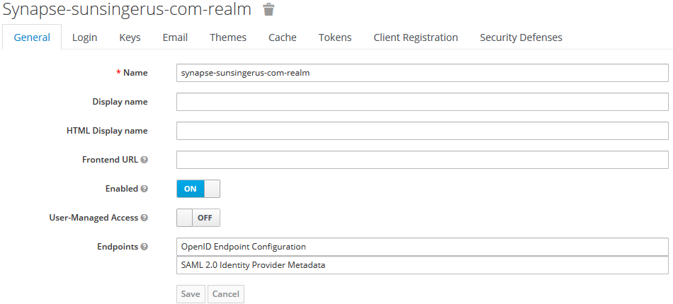
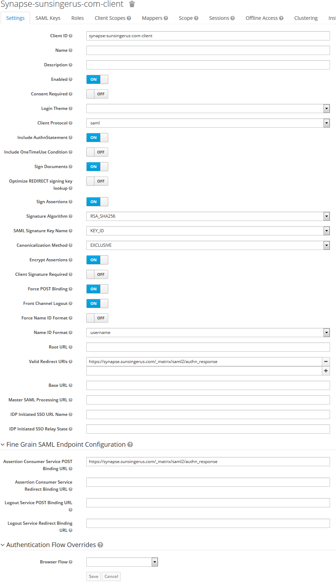
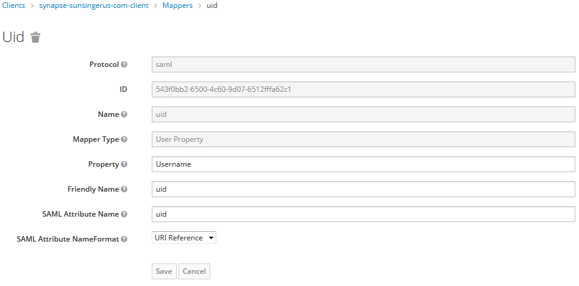
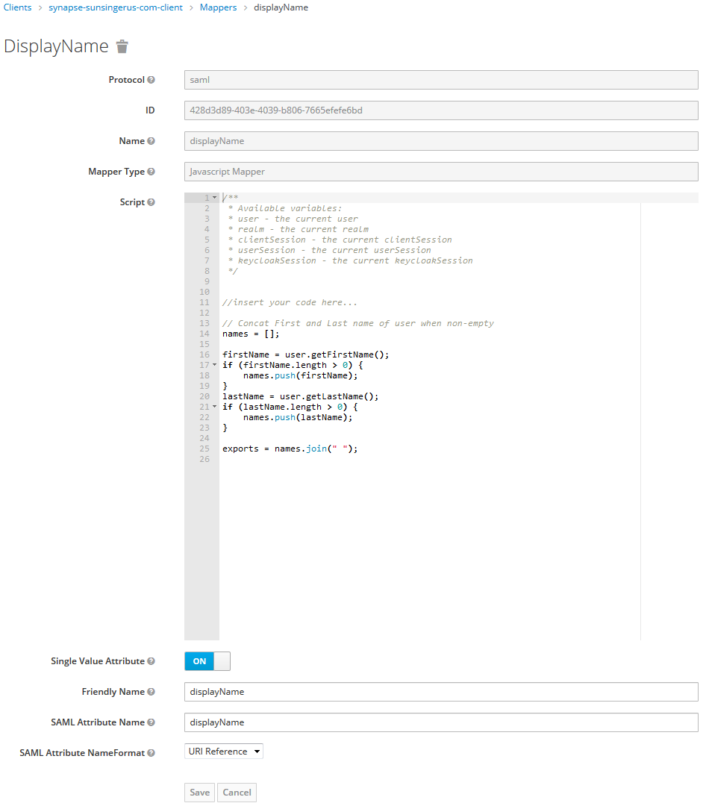

# How to setup SAML2 with Keycloak

Login into Keycloak

### Create realm
```
synapse-sunsingerus-com-realm
```



### Create client
```
synapse-sunsingerus-com-client
```


### Set Valid Redirect URLs to
```
https://synapse.sunsingerus.com/_matrix/saml2/authn_response
```

### Set Fine Grain SAML Endpoint Configuration->Assertion Consumer Service POST Binding URL to the same
```
https://synapse.sunsingerus.com/_matrix/saml2/authn_response
```

At the end of the day client should looks like:



### Create mappers
UID mapper:


displayName mapper:


Code used in mapper:

```js
// Concat First and Last name of user when non-empty
names = [];

firstName = user.getFirstName();
if (firstName.length > 0) {
    names.push(firstName);
}
lastName = user.getLastName();
if (lastName.length > 0) {
    names.push(lastName);
}

exports = names.join(" ");
```

### Apply `key.pem` and `cert.pem`

They are normally used as `/synapse/config/key.pem` and `/synapse/config/cert.pem`
and are published through `ConfigMap`'s `key.pem` and `cert.pem` entries.


Fetch them from Keycloak Client's **SAML Keys** tab page as following:


**[Generate New Keys]** -> **Export** ->
```
    Archive Format: PKCS12
    Key Alias: The name of your Keycloak Client.
    Key Password: A password which is used later to decrypt package downloaded
    Realm Certificate Alias: The name of yout Keycloak Realm
    Store password: A password which is used later to decrypt package downloaded
```
You should get a file named `keystore.p12`

Extract keys with the help of `SAML2_extract_keys.sh` script.

**SAML2_extract_keys.sh**:
```bash
export KEYSTORE_PW="qwerty"
openssl pkcs12 -in keystore.p12 -password "pass:${KEYSTORE_PW}" -nocerts -nodes | openssl rsa -out key.pem
openssl pkcs12 -in keystore.p12 -password "pass:${KEYSTORE_PW}" -nodes | openssl x509 -out cert.pem
```

Insert `key.pem` and `cert.pem` into appropriate places in `ConfigMap`

### Create users

### ENJOY!


